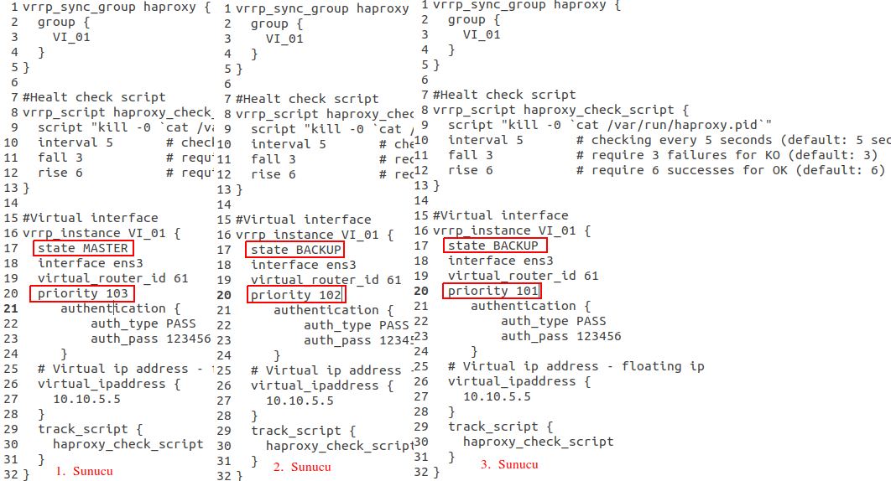
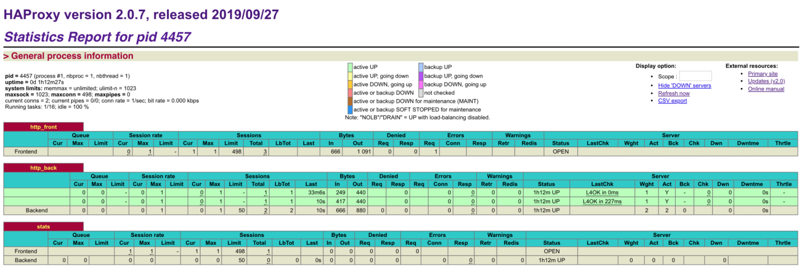

# HAProxy ve Keepalived (LoadBalancer+Cluster+Sec+HighLoads) Kurulum ve Yapılandırması

#

**HAProxy**, yüksek erişilebilirliğe(high availability) sahip yük dengeleyici(load balancing) ile **TCP** ve **HTTP** tabanlı uygulamalar için **proxy** sunucusu hizmeti veren açık kaynak kodlu bir yazılımdır.

**Keepalived**, **IP failover**(yük devretme) yeteneğini ikiden daha fazla sunucu için sağlayacak yeteneğe sahip açık kaynak kodlu bir yazılımdır. **Keepalived** kendi arasında **Multicast** haberleşme tekniğini kullanmaktadır.

Biz yapımızda **HAProxy load balancer** için, **Keepalived**’i de **IP** devretmek yani **HAProxy** yapımızı **Cluster** hale getirmek için kullanacağız.

Senaryomuzda 3 adet sunucu bulunmaktadır. Bu 3 sunucuya HAProxy kurarak load balancer hale getireceğiz. Ardından Keepalived servisini kurarak sunuculardan biri kapandığında IP failover yaparak kesinti olmadan diğer sunucuya geçerek load balancer servisimizin çalışmasını sağlıyacağız.

Bunun için 4 adet IP kullanacağız(ip ler tamamen atmasyon)

1. Sunucu : 10.10.5.13
2. Sunucu : 10.10.5.14
3. Sunucu : 10.10.5.15
4. Keepalived Virtual Ip : 10.10.5.5

Şimdi her 3 sunucuya **HAProxy** ve **Keepalived** servisini aşağıdaki gibi kuralım.

~~~
sudo add-apt-repository ppa:vbernat/haproxy-2.7 -y
sudo apt update
sudo apt install haproxy keepalived -y
sudo openssl dhparam -out /etc/haproxy/dhparams.pem 2048
~~~

**NoT1** : Sunucularda “**net.ipv4.ip_nonlocal_bind=1**” olması gerekiyor. Yoksa **HAProxy** için kullanılacak yapılandırma üzerinde aynı anda aynı ip yi barındıramayacağı için bind hatası verecek ve servis çalışmayacaktır. Bunun için aşağıdaki yolu izlemeniz gerekiyor.

İlk olarak “**vi /etc/sysctl.conf**” dosyasının için edit edin ve aşağıdaki parametreyi yapıştırıp kaydedip çıkın.

~~~
net.ipv4.ip_nonlocal_bind=1
~~~

Daha sonra aşağıdaki komutu çalıştırın.

~~~
sysctl -p
~~~

**Not2**: **443 SSL** kulanacaksanız “**/etc/ssl/private/**” dizini içinde “**haproxy.pem**” adından **SSL**’lerinizin Bundle(***.crt,*.ca,*.key**) hali bulunması gerekiyor.

Şimdi Örnek olarak aşağıda **HAPoxy** yapılandırmasına bakalım. Yapınızda her **HAProxy** için aynı yapılandırmayı kullanacaksınız.

### HAPoxy

Bunun için “**/etc/haproxy/haproxy.cfg**” dosyasını edit edeceksiniz. **Aşağıdaki yapılandırma min HAv2 desteklemektedir**.

~~~
vi /etc/haproxy/haproxy.cfg
~~~

Aşağıda default değerlerde mevcuttur
~~~
global
        log /dev/log    local0
        log /dev/log    local1 notice
        chroot /var/lib/haproxy
        stats socket /run/haproxy/admin.sock mode 660 level admin expose-fd listeners
        stats timeout 30s
        user haproxy
        group haproxy
        daemon
#        maxconn 100000 #replaceable

        # Default SSL material locations
        ca-base /etc/ssl/certs
        crt-base /etc/ssl/private

        # Default ciphers to use on SSL-enabled listening sockets.
        # For more information, see ciphers(1SSL). This list is from:
        #  https://hynek.me/articles/hardening-your-web-servers-ssl-ciphers/
        # An alternative list with additional directives can be obtained from
        #  https://mozilla.github.io/server-side-tls/ssl-config-generator/?server=haproxy
        ssl-default-bind-ciphers ECDH+AESGCM:DH+AESGCM:ECDH+AES256:DH+AES256:ECDH+AES128:DH+AES:RSA+AESGCM:RSA+AES:!aNULL:!MD5:!DSS
        #ssl-default-bind-options no-sslv3
	ssl-default-bind-ciphers ECDHE-ECDSA-AES128-GCM-SHA256:ECDHE-RSA-AES128-GCM-SHA256:ECDHE-ECDSA-AES256-GCM-SHA384:ECDHE-RSA-AES256-GCM-SHA384:ECDHE-ECDSA-CHACHA20-POLY1305:ECDHE-RSA-CHACHA20-POLY1305:DHE-RSA-AES128-GCM-SHA256:DHE-RSA-AES256-GCM-SHA384
	ssl-default-bind-options ssl-min-ver TLSv1.2 no-tls-tickets
	ssl-dh-param-file /etc/haproxy/dhparams.pem
	#tune.ssl.default-dh-param 2048

#	nbproc 1
#	nbthread 8

	tune.maxrewrite 16384
	tune.bufsize 32768

defaults
        log     global
        mode    http
        option  httplog
        option  dontlognull
	option forwardfor
#        maxconn 1000000 #replaceable
        timeout connect 3000000
        timeout client  6000000
        timeout server  6000000
        errorfile 400 /etc/haproxy/errors/400.http
        errorfile 403 /etc/haproxy/errors/403.http
        errorfile 408 /etc/haproxy/errors/408.http
        errorfile 500 /etc/haproxy/errors/500.http
        errorfile 502 /etc/haproxy/errors/502.http
        errorfile 503 /etc/haproxy/errors/503.http
        errorfile 504 /etc/haproxy/errors/504.http
~~~

**HAProxy** için **Dashboard** yapılandırma kısmı(monitoring için **prometheus** entegrasyonu eklendi)
~~~
listen stats
        bind fatlan.com:8989
        mode http
        stats enable
        stats uri /stats
        option http-use-htx
        http-request use-service prometheus-exporter if { path /metrics }
        #stats hide-version
        stats realm HAProxy\ Statistics
        stats auth admin:admin
~~~

Aşağıdaki yapılandırmada iki blog’ta **ACL** kullanıldı. İlk blog, **link**’in içinde herhangi bir yerde “**rest**” kelimesi geçerse **middleware-fatlan-backend** bloğu çalışacak, ikincisinde farklı bir domain isteğinde(**forum.fatlan.com**) **backend fatlan-forum-backend** çalışacak, haricinde tüm istekler **fatlan-backend443** bloğunda çalışacak. Diğer port yönlendirmeleri hariç.

**80 portunu 443 portuna** yönlendirme kısmı
~~~
frontend fatlan80
        bind fatlan.com:80
        mode http
        redirect scheme https if !{ ssl_fc }

frontend fatlan443
        bind fatlan.com:443 ssl crt /etc/ssl/private/haproxy.pem ciphers ECDH+AESGCM:DH+AESGCM:ECDH+AES256:DH+AES256:ECDH+AES128:DH+AES:ECDH+3DES:DH+3DES:RSA+AESGCM:RSA+AES:RSA+3DES:!aNULL:!MD5:!DSS
        option httplog
	option forwardfor
 	#http-request set-header X-Client-IP req.hdr_ip([X-Forwarded-For])
        #option forwardfor except 127.0.0.0/8
        option http-server-close
	http-request set-header X-Forwarded-Proto https
#        reqadd X-Forwarded-Proto:\ https #old config
        mode http
        default_backend fatlan-backend443
~~~

ACL örnek yapilandirilmasi(proxypass) linkte herhangi biryerde **rest** kelimesi geçerse yönlendir
~~~
        acl middleware-fatlan path_beg /rest
        use_backend middleware-fatlan-backend if middleware-fatlan
~~~

ACL farklı **forum** host yönlendir
~~~
    	acl host_fatlanforum hdr(host) -i forum.fatlan.com
    	use_backend fatlan-forum-backend if host_fatlanforum
~~~

Default yönlendirilen kısım, **443** için yönlendirilen kısım
~~~
backend fatlan-backend443
        mode http
        balance roundrobin
        stick store-request src
        stick-table type ip size 256k expire 30m
        option forwardfor
#        option httplog
        option httpchk HEAD /
	
        server frontend_01 10.10.37.12:8001 check port 8001 inter 3000 rise 2 fall 3
        server frontend_02 10.10.37.13:8001 check port 8001 inter 3000 rise 2 fall 3
~~~

ACL gelen, **rest** yönlendirilen kısım
~~~
backend middleware-fatlan-backend
        mode http
        balance roundrobin
        stick store-request src
        stick-table type ip size 256k expire 30m
        option forwardfor
#        option httplog
        option httpchk OPTIONS /login HTTP/1.0
        http-check expect status 200
	http-request replace-path (.*)(?:rest\/)(.*) \1\2
#        reqrep ^([^\ :]*)\ /rest[/]?(.*) \1\ //\2  #old config 
	
        server middleware_01 10.10.37.34:3000 check port 4000 inter 12000 rise 3 fall 3
        server middleware_02 10.10.37.35:3000 check port 4000 inter 12000 rise 3 fall 3
~~~

ACL gelen, **forum** yönlendirilen kısım
~~~
backend fatlan-forum-backend
        mode http
        option forwardfor
#        option httplog
        option httpchk HEAD /
	
        server forum_01 10.10.37.45:8080 check port 8080 inter 3000 rise 2 fall 3
~~~

Harici örnekler aşağıdaki gibi de yapılandırılabilir.

**5000 portuna örnek**;
~~~
frontend Panel5000
        bind fatlan.com:5000
#        option httplog
        option forwardfor except 127.0.0.0/8
        #option http-server-close
	http-request set-header X-Forwarded-Proto https
#        reqadd X-Forwarded-Proto:\ https #old config
        mode http
        default_backend panel-backend5000
~~~

**5000** portu yönlendirilen kısım
~~~
backend panel-backend5000
        mode http
        balance roundrobin
        stick store-request src
        stick-table type ip size 256k expire 30m
        option forwardfor
#        option httplog
        option httpchk HEAD /
	
        server panel_01 10.10.37.43:5000 check port 5000 inter 12000 rise 3 fall 3
        server panel_02 10.10.37.44:5000 check port 5000 inter 12000 rise 3 fall 3
~~~

**3306 mysql örnek**;
~~~
frontend fatlanmysql
        bind fatlan.com:3306
        mode tcp
        default_backend fatlanmysql-backend3306
~~~

**3306** portu yönlendirilen kısım
~~~
backend fatlanmysql-backend3306
        mode tcp
	
        server mysql_01 10.10.37.60:3306 check
        server mysql_02 10.10.37.61:3306 check backup
        server mysql_03 10.10.37.62:3306 check backup
~~~

Başka domain, subdomain ya da portlar için de yönlendirmeyi yine aynı haproxy üzerinden yapabilirsiniz. Gerçi yukarıda subdomaain için ACL yönlendirmesini de görmüştük.

**egitim.fatlan.com subdomain'i için 4444 portuna örnek**;
~~~
frontend egitim4444
        bind egitim.fatlan.com:4444
#        option httplog
        option forwardfor except 127.0.0.0/8
        #option http-server-close
	http-request set-header X-Forwarded-Proto https
#        reqadd X-Forwarded-Proto:\ https #old config
        mode http
        default_backend egitim-backend4444
~~~

**egitim.fatlan.com subdomain'i 4444** portu yönlendirilen kısım
~~~
backend egitim-backend4444
        mode http
        balance roundrobin
        stick store-request src
        stick-table type ip size 256k expire 30m
        option forwardfor
#        option httplog
        option httpchk HEAD /
	
        server egitim_01 10.10.37.77:4444 check port 4444 inter 12000 rise 3 fall 3
        server egitim_02 10.10.37.78:4444 check port 4444 inter 12000 rise 3 fall 3
~~~

Yukarıda örnek **HAProxy** yapılandırmalarından bahsettim, ben kendi yapılandırmamı yaptım ve **3 sunucuda aynı** yapılandırmaları yapıştırdım.

### Keepalived

Şimdi **Keepalived** yapılandrımasını yapalım. **Keepalived** için **3 sunucuda** da **kısmi olarak farklı** parametrik ayarlar mecvut olacak. Bunun için “**/etc/keepalived/keepalived.conf**” dosyasını oluşturup, yapılandıracağız. Bu arada “**priority**” yüksek olan önceliklidir.

**NoT1:** **Keepalived** diğer **peer**'leri ile arasında **multicast** haberleşir ve bu yolla **master** **backup** belirlenir.

**Tcpdump** ile de **peer**'lar arası **multicast** iletişimi **capture** edebilirsiniz(**tcpdump -n  "multicast"**).

[https://www.redhat.com/sysadmin/keepalived-basics](https://www.redhat.com/sysadmin/keepalived-basics)

**1. Sunucu(HAProxy+Keepalived)**
~~~
vrrp_sync_group haproxy {
  group {
   VI_01
  }
}

vrrp_script haproxy_check_script {
  script "killall -0 haproxy"
  interval 2 # checking every 2 seconds (default: 5 seconds)
  fall 3 # require 3 failures for KO (default: 3)
  rise 6 # require 6 successes for OK (default: 6)
}

#Virtual interface
vrrp_instance VI_01 {
  state MASTER
  interface ens3
  ### 61 id'sini degistirin, diger peer'lerde de aynı olacak
  virtual_router_id 61
  ### 103 id'sini degistirin, diger peer'lerde azalan şekilde olacak
  priority 103
  
  authentication {
    auth_type PASS
    auth_pass 123456
  }

# Virtual ip address – floating ip
  virtual_ipaddress {
    10.10.5.5
  }
  
  track_script {
    haproxy_check_script
  }
}
~~~

**2. Sunucu(HAProxy+Keepalived)** (Sadece farkları yazıyorum)
~~~
  state BACKUP
  priority 102
~~~

**3. Sunucu(HAProxy+Keepalived)** (Sadece farkları yazıyorum)
~~~
  state BACKUP
  priority 101
~~~

**NoT2**: Eğer sunucular arasında **multicast** haberleşmenin mümkün olmadığı durumlarda(ör: kvm, cloud ortamlar vs) **unicast** haberleşme kullanarak config etmeniz gerekir aksi halde zaten çalışmayacaktır.

**Unicast Config:** aşağıdaki gibi yapılandırmanın arasına eklenebilir.
~~~
###Her sunucu için diğer eşneliği(peer) ip olarak belirtilmelidir(yazılır)

...
#Virtual interface
...

  unicast_peer {
    <anaother_peer_ip>
    <anaother_peer_ip>
  }

# Virtual ip address – floating ip
...

~~~

Yapılandırmalar bu kadar, tüm suncularda HAProxy sorunsuz çalışır vaziyette olmalı aynı zaman keepalived servisi de. Sunucularda yada servislerde herhangi bir kesintide çalışan diğer sunucudan loadbalancer hizmet vermeye devam edecektir.

### High Loads

**HAProxy ve Linux kernel yüksek yükler için ayarlama**

1.
~~~
sudo vi /etc/security/limits.conf

* soft no le 1000000
* hard no le 1000000
root soft no le 1000000
root hard no le 1000000
~~~
2.
~~~
sudo vi /etc/default/haproxy

ulimit 1000000
~~~
3.
~~~
sudo vi /lib/systemd/system/haproxy.service

LimitNOFILE=1000000
~~~
4.
~~~
sudo vi /etc/sysctl.conf

net.ipv4.ip_local_port_range=1024 65535
net.ipv4.tcp_max_syn_backlog = 100000
net.core.somaxconn = 100000
net.core.netdev_max_backlog = 100000
~~~
5.
~~~
sudo vi /etc/haproxy/haproxy.cfg

global
    nbproc 1
    nbthread 8
    tune.maxrewrite 16384
    tune.bufsize 32768
    maxconn 1000000
    tune.ssl.cachesize 1000000
defaults
    maxconn 1000000
~~~

Ardından **reboot**, eğer **reboot** hemen mümkün değilse

~~~
sudo systemctl daemon-reload
sudo systemctl restart haproxy.service
~~~

### Security

Ayrıca zayıf SSL/Kripto Kullanımı (LOGJAM) (CVE-2015-4000) güvenlik testlerini yapmanız için de aşağıdaki komuttan faydalanabilirsiniz ya da [https://www.ssllabs.com/ssltest/](https://www.ssllabs.com/ssltest/)

~~~
sudo nmap -sV --script ssl-enum-ciphers -p 443 fatlan.com

sudo nmap -p 443 --script ssl-cert fatlan.com

openssl s_client -connect fatlan.com:443
~~~

Ayrıca yukarıdaki **config**'ler de **client ip** elde etmek için mevcut olan **x-forwarder-for**(**option forwardfor**) yapılandırmasının doğrulamasını, yani ip'leri **haproxy** tarafında **capture** edebilmek için **tcpdump** kullanabilirsiniz.

~~~
sudo tcpdump -i ens3 -A -s 10240 | grep -v IP | egrep --line-buffered "..(GET |\.HTTP\/|POST |HEAD )|^[A-Za-z0-9-]+: " |sed -r 's/..(GET |HTTP\/|POST |HEAD )/\n\n\1/g'
~~~

# 

